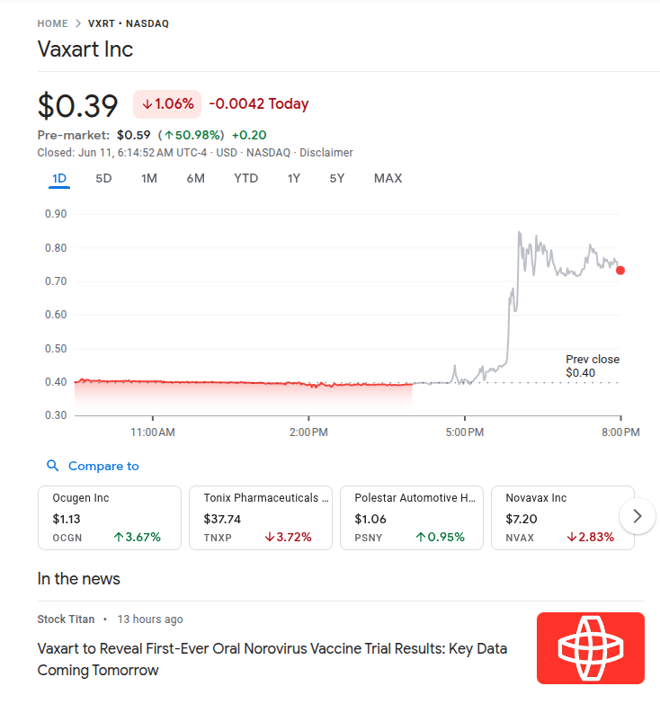
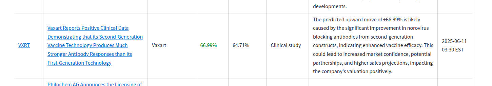
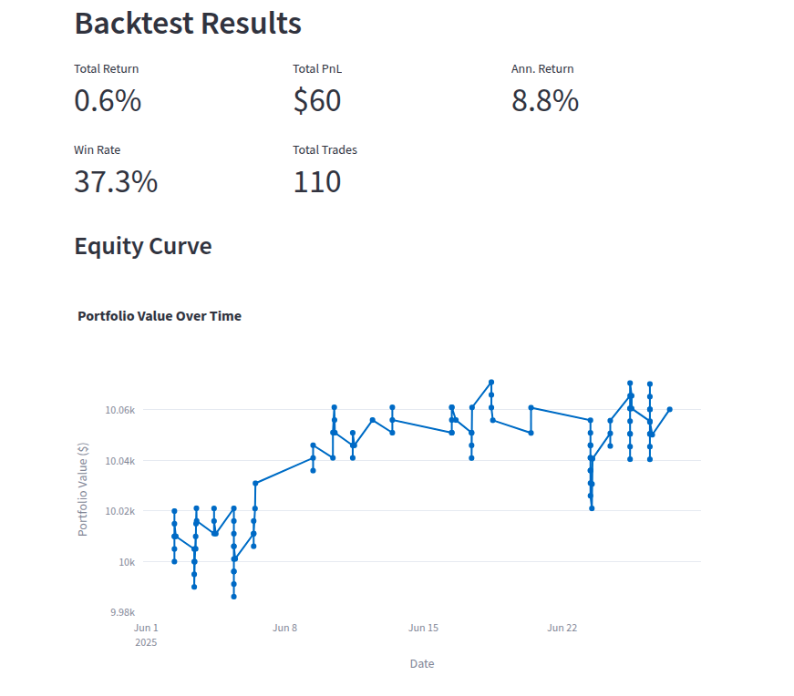

# Finespresso Modelling - Financial News Impact Prediction

A machine learning platform that predicts the impact of financial news / press releases on stock prices using natural language processing and machine learning techniques. It also includes basic backtesting utilities to execute trades based on the signal and measure the financial performance of the strategy.

## 🎯 Project Overview

This system analyzes financial news articles and predicts:
1. **Direction Classification**: Whether a stock will go UP or DOWN after news release
2. **Price Movement Regression**: The percentage change in stock price

The models are trained on real financial news data with corresponding price movements, covering various event types like earnings releases, clinical studies, mergers & acquisitions, and more.


## 🖼️ Case Study

Below is an example of a large (about 100%) overnight price move as a result of a press release and our system prediction:

**Figure - Overnight News Announcement for Vaxart (NASDAQ:VXRT)**


**Figure - Finespresso Prediction**


Source: [Finespresso Demo](https://research.finespresso.org)

## 📊 Current Model Performance

### Classification Models
- **Average Accuracy**: ~62% across all events
- **Best Performing Events**: 
  - Partnerships: 90.9% accuracy
  - Annual General Meeting: 87.5% accuracy
  - Corporate Action: 70% accuracy

### Regression Models
- **Average R² Score**: Currently negative (indicating room for improvement)
- **Best Performing Events**: 
  - Management Changes: R² = 0.033
  - Business Contracts: R² = 0.044
  - Voting Rights: R² = 0.022

## 📊 Current Backtesting Performance

**Figure - Sample Backtest Results**


Source: [Finespresso Backtester](https://research.finespresso.org/Backtester)

## 🏗️ Modelling Platform Architecture

### Data Pipeline
```
Database → CSV Export → Model Training → Results & Models
```

### Data Sources

The system utilizes price data from multiple major exchanges:
- **Nasdaq Nordic (OMX)**: Nordic and Baltic region stocks
- **Nasdaq Baltics**: Baltic region securities
- **Nasdaq US**: US-listed securities
- **Euronext**: European securities across multiple markets

This multi-exchange approach provides comprehensive coverage of global financial markets and enables the system to analyze news impact across different geographical regions and market structures.

### Price Move Calculation

The system calculates price movements based on the publication time of news articles relative to market hours (9:30 AM - 4:00 PM ET). The calculation rules are:

1. **Market Hours (9:30 AM ≤ published_date < 4:00 PM)**:
   ```
   price_move = price(t, close) - price(t, open)
   ```
   *Measures the intraday price movement from market open to close on the same trading day*

2. **Pre-Market (published_date < 9:30 AM)**:
   ```
   price_move = price(t, open) - price(t-1, close)
   ```
   *Measures the overnight gap from previous day's close to current day's open*

3. **After Hours (published_date > 4:00 PM)**:
   ```
   price_move = price(t, close) - price(t+1, open)
   ```
   *Measures the overnight gap from current day's close to next day's open*

**Note**: All times are in Eastern Time (ET) and price movements are calculated as percentage changes relative to the base price.

### Model Types
- **Random Forest Classifier**: For UP/DOWN prediction
- **Random Forest Regressor**: For price percentage prediction
- **TF-IDF Vectorization**: Text feature extraction
- **spaCy Preprocessing**: Text cleaning and lemmatization

### File Organization
```
finespresso-modelling/
├── data/                    # Raw input data CSV files - news, instruments and price moves
├── models/                  # Trained model files (.joblib)
├── playground/             # Data download utilities
├── reports/                 # Model performance and backtesting results
├── tasks/ai/               # Training and prediction scripts
└── tests/                  # Unit tests
```

## 🚀 Quick Start

### 1. Setup Environment
```bash
# Clone and setup
git clone <repository>
cd finespresso-modelling
python -m venv .venv
source .venv/bin/activate
pip install -r requirements.txt

# Set up database connection
echo "DATABASE_URL='your_database_url'" > .env
```

### 2. Download Data
```bash
python playground/download_data.py
```

### 3. Train Models
```bash
# Train classification models
python tasks/ai/train_classifier.py

# Train regression models
python tasks/ai/train_regression.py
```

### 4. View Results
- **Model Performance**: `reports/model_results_binary.csv` and `reports/model_results_regression.csv`
- **Trained Models**: `models/` directory
- **Raw Data**: `data/` directory

## 📈 Model Training Process

### Current Approach
1. **Data Loading**: Load merged news and price data from CSV
2. **Text Processing**: 
   - Priority: `content_en` → `title_en` → `content` → `title`
   - spaCy preprocessing (lemmatization, stop word removal)
3. **Feature Extraction**: TF-IDF vectorization (1000 features max)
4. **Model Training**: 
   - Individual models per event (min 10 samples)
   - All-events fallback model
5. **Evaluation**: 80/20 train-test split with cross-validation metrics

### Current Limitations
- Basic text features only
- No market context features
- Simple TF-IDF vectorization
- Limited hyperparameter tuning
- No experiment tracking

## 🎯 Take-Home Challenge: Model Improvement

You are tasked with improving the financial news impact prediction system. The current models show promise but have significant room for improvement. Your challenge is to enhance the system across multiple dimensions.

### Challenge Tasks

#### 1. 📊 Data Quality Enhancement (Priority: High)
**Current State**: Basic text preprocessing with potential data quality issues

**Your Tasks**:
- [ ] Analyze data quality issues in `data/all_price_moves.csv`. In particular, you will notice we have about 57k news articles but only about 2700 corresponding price moves. The price moves and news are connected via instruments so the goal would be to link the data sets better and download additional moves.
- [ ] Implement data cleaning for outliers and anomalies
- [ ] Add data validation checks for price movements
- [ ] Create data quality metrics and monitoring
- [ ] Handle missing values and text preprocessing edge cases
- [ ] Implement data versioning and lineage tracking

**Expected Impact**: 5-10% improvement in model accuracy

#### 2. 🏢 Feature Engineering & Market Context (Priority: High)
**Current State**: Only text features used

**Your Tasks**:
- [ ] Integrate Yahoo Finance API (`yfinance`) for additional features:
  - Market capitalization
  - Stock float ratio
  - Exchange information
  - Sector/industry classification
  - Trading volume
  - Beta coefficient
- [ ] Add time-based features:
  - Market hours vs after-hours
  - Day of week effects
  - Earnings season indicators
- [ ] Create company-specific features:
  - Historical volatility
  - Previous news sentiment
  - Company size classification
- [ ] Implement feature selection and importance analysis

**Expected Impact**: 10-20% improvement in model accuracy

#### 3. 🤖 Model Architecture Improvements (Priority: Medium)
**Current State**: Basic Random Forest models

**Your Tasks**:
- [ ] Experiment with different model architectures:
  - Gradient Boosting (XGBoost, LightGBM)
  - Deep Learning (LSTM, Transformer-based models)
  - Ensemble methods
- [ ] Implement hyperparameter optimization (Optuna, Hyperopt)
- [ ] Add model interpretability (SHAP, LIME)
- [ ] Create model comparison framework
- [ ] Implement cross-validation strategies

**Expected Impact**: 5-15% improvement in model accuracy

#### 4. 📝 Advanced Text Processing (Priority: Medium)
**Current State**: Basic TF-IDF with spaCy preprocessing

**Your Tasks**:
- [ ] Implement advanced text vectorization:
  - Word2Vec, GloVe, FastText embeddings
  - BERT/RoBERTa fine-tuning
  - Sentence transformers
- [ ] Add domain-specific financial vocabulary
- [ ] Implement sentiment analysis features
- [ ] Create text augmentation techniques
- [ ] Add multilingual support

**Expected Impact**: 8-15% improvement in model accuracy

#### 5. 🧠 LLM Integration (Bonus Challenge)
**Current State**: Traditional ML only

**Your Tasks**:
- [ ] Implement few-shot classification using LLMs:
  - OpenAI GPT models
  - Local LLMs (Llama, Mistral)
  - Claude API integration
- [ ] Create prompt engineering for financial news
- [ ] Implement LLM-based feature extraction
- [ ] Add LLM ensemble with traditional models
- [ ] Create cost-effective LLM usage patterns

**Expected Impact**: 15-25% improvement in model accuracy

#### 6. 📊 Experiment Tracking with MLFlow & MLOps (Bonus Challenge)
**Current State**: No experiment tracking

**Your Tasks**:
- [ ] Integrate MLflow for experiment tracking:
  - Model versioning
  - Hyperparameter logging
  - Performance metrics tracking
  - Model comparison dashboards
- [ ] Implement model serving pipeline
- [ ] Add automated retraining workflows
- [ ] Create model monitoring and alerting
- [ ] Implement A/B testing framework

**Expected Impact**: Better model management and reproducibility

#### 7. 🧪 Backtesting & Evaluation (Bonus Challenge)
**Current State**: Backtesting pipeline for event-driven trading is available

**Your Tasks**:
- [ ] Run and analyze backtests using the provided pipeline
- [ ] Compare before/after model improvements on backtest results
- [ ] Add new evaluation metrics or visualizations
- [ ] Document and automate backtest workflows

**Reference**: See [`tasks/backtesting/README.md`](tasks/backtesting/README.md) for usage and output examples and [Finespresso Backtester](https://research.finespresso.org/Backtester) for a live demo.

### 🎯 Success Metrics

**Primary Goals**:
- Achieve >70% accuracy for classification models
- Achieve higher R² scores and other similar metrics for regression models
- Reduce prediction variance across different events

**Secondary Goals**:
- Improve model interpretability
- Reduce training time
- Create reproducible experiments
- Build scalable inference pipeline

### 📋 Deliverables

1. **Enhanced Training Scripts**: Improved versions of `train_classifier.py` and `train_regression.py`
2. **Feature Engineering Pipeline**: Scripts to extract and integrate new features
3. **Model Comparison Report**: Analysis of different approaches and their performance
4. **Documentation**: Updated README with your improvements
5. **Code Quality**: Clean, well-documented, and tested code

## 📊 Before/After Backtesting Results

You should compare your model improvements using the backtesting pipeline. Example output:

**Before:**
```
Total Return:        0.3%
Annualized Return:   4.0%
Total PnL:           $31
Total Trades:        100
Win Rate:            30.0%
Average Trade PnL:   $0
Max Drawdown:        0.0%
```

**After:**
```
Total Return:        1.0%
Annualized Return:   12.3%
Total PnL:           $98
Total Trades:        198
Win Rate:            36.9%
Average Trade PnL:   $0
Max Drawdown:        0.0%
```

See [`tasks/backtesting/README.md`](tasks/backtesting/README.md) for more details and sample output.


## 🛠️ Recommended Code Editors

For the best developer experience, we recommend using one of the following code editors with this repository:

- [Cursor](https://www.cursor.so/) — AI-powered code editor with deep repo integration
- [Windsurf](https://windsurf.com/) — Modern code editor with AI and repo tools
- [Claude Code](https://www.anthropic.com/claude-code) — Claude's code workspace for collaborative AI coding

These editors support advanced navigation, AI code completion, and are well-suited for large Python projects like this one.

## 🤝 Contributing

### For Take-Home Challenge Participants

If you're working on the take-home challenge, please follow this workflow:

#### 1. Fork the Repository
```bash
# Fork this repository on GitHub
# Then clone your fork locally
git clone https://github.com/predictivelabs/finespresso-modelling.git
cd finespresso-modelling
```

#### 2. Create a Feature Branch
```bash
# Create and switch to a new feature branch
git checkout -b feature/your-improvement-name

# Examples:
git checkout -b feature/yfinance-integration
git checkout -b feature/bert-embeddings
git checkout -b feature/mlflow-tracking
```

#### 3. Implement Your Improvements
- Follow the challenge tasks outlined above
- Keep your commits atomic and well-described
- Add tests for new functionality
- Update documentation as needed

#### 4. Commit Your Changes
```bash
# Add your changes
git add .

# Commit with descriptive messages
git commit -m "feat: integrate Yahoo Finance API for market features"
git commit -m "feat: implement BERT embeddings for text processing"
git commit -m "feat: add MLflow experiment tracking"
```

#### 5. Push and Create Pull Request
```bash
# Push your feature branch
git push origin feature/your-improvement-name

# Create a Pull Request on GitHub
# Include:
# - Description of your improvements
# - Performance metrics comparison
# - Screenshots of results (if applicable)
# - Any additional setup instructions
```

#### 6. Pull Request Template
When creating your PR, please include:

```markdown
## 🎯 Challenge Task(s) Addressed
- [ ] Data Quality Enhancement
- [ ] Feature Engineering & Market Context
- [ ] Model Architecture Improvements
- [ ] Advanced Text Processing
- [ ] LLM Integration
- [ ] Experiment Tracking & MLOps

## 📊 Performance Improvements
- **Before**: [Baseline metrics]
- **After**: [Your improved metrics]
- **Improvement**: [Percentage/absolute improvement]

## 🛠️ Technical Changes
- [List of major changes made]
- [New dependencies added]
- [Files modified/added]

## 📋 Testing
- [ ] Unit tests added
- [ ] Integration tests added
- [ ] Performance benchmarks included

## 📚 Documentation
- [ ] README updated
- [ ] Code comments added
- [ ] Setup instructions included
```

### For General Contributors

If you're contributing to the main project (not the take-home challenge):

1. **Open an Issue**: Describe the bug or feature request
2. **Create a Branch**: Use `fix/` or `feature/` prefix
3. **Follow Code Style**: Use consistent formatting and naming
4. **Add Tests**: Ensure new code is tested
5. **Update Docs**: Keep documentation current
6. **Submit PR**: Create a pull request with clear description

### Code Style Guidelines

- **Python**: Follow PEP 8 standards
- **Documentation**: Use docstrings for functions and classes
- **Commits**: Use conventional commit messages
- **Tests**: Aim for >80% code coverage
- **Type Hints**: Use type hints for function parameters and returns

### Review Process

1. **Automated Checks**: CI/CD pipeline runs tests and linting
2. **Code Review**: At least one maintainer reviews the PR
3. **Performance Review**: For model changes, performance impact is assessed
4. **Documentation Review**: Ensure documentation is clear and complete
5. **Merge**: Once approved, PR is merged to main branch

---

**Good luck! We're excited to see your innovative approaches to improving financial news impact prediction! 🚀**

